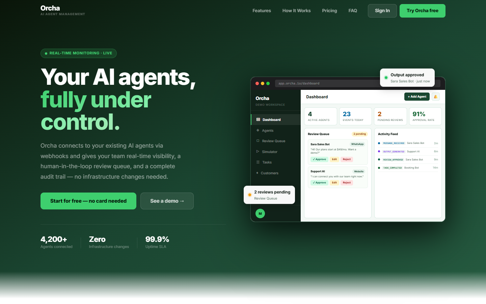
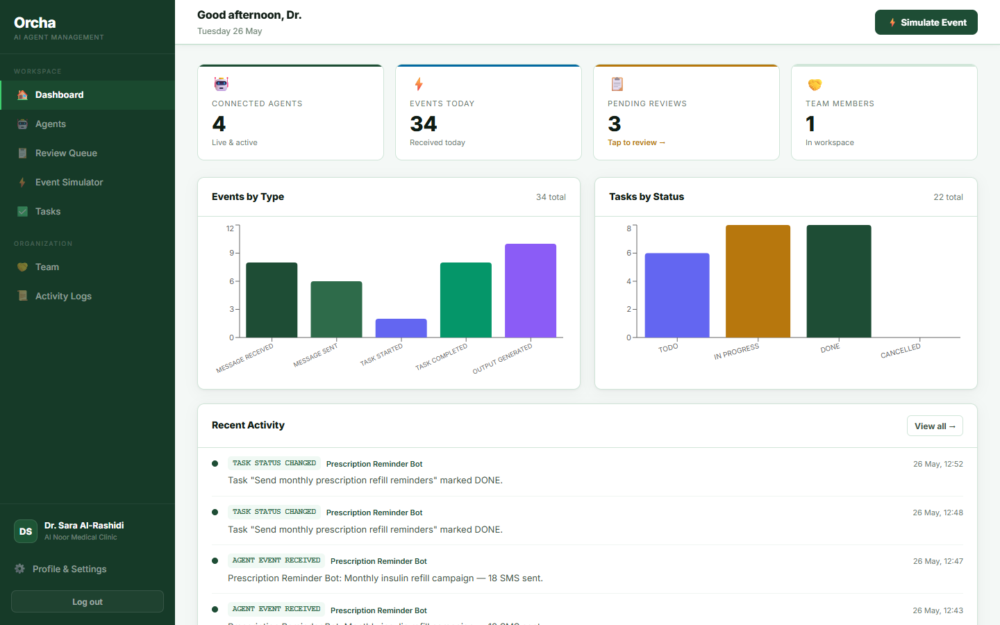
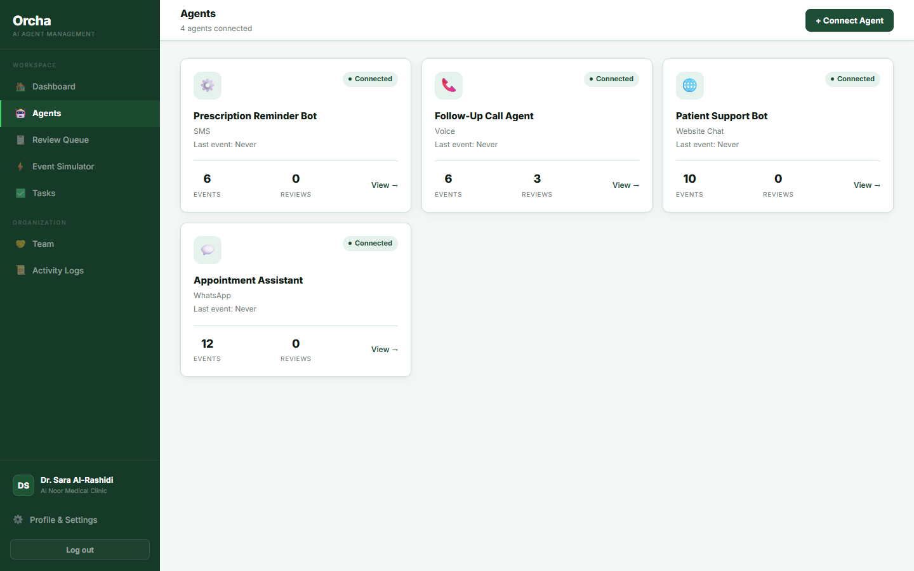
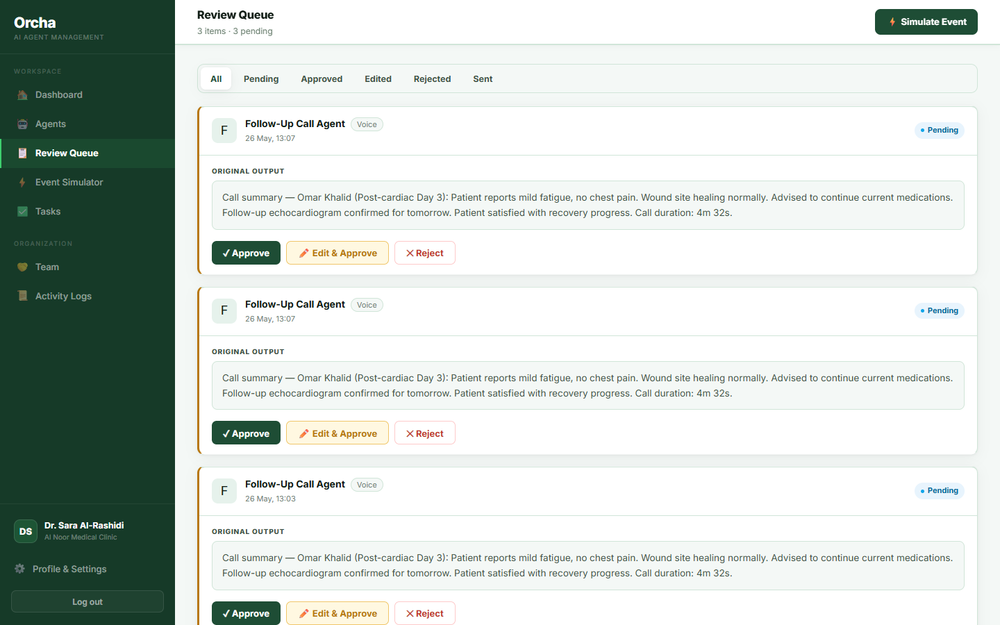
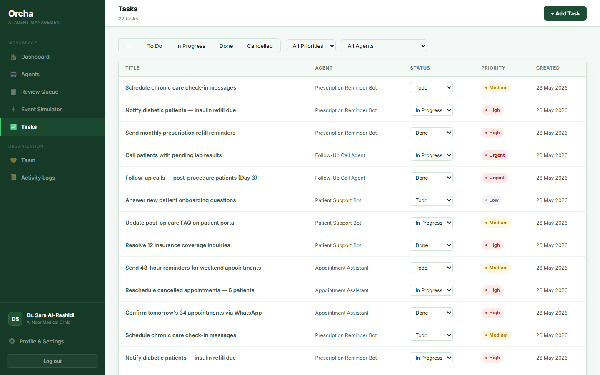

<div align="center">
  
</div>

<br/>

# Orcha &nbsp;·&nbsp; AI Agent Management Platform

Orcha gives teams a single control plane for every AI agent they run. Connect agents across WhatsApp, voice, website chat, email, and custom APIs. Every message, task, and AI-generated output flows into one dashboard — with a built-in review queue so humans stay in the loop before anything reaches a customer.

**[→ Live Demo](https://orcha-official.up.railway.app)** &nbsp;·&nbsp; `manager@orcha.demo` / `password123`

---

## Demo — Al Noor Medical Clinic

The live demo is pre-loaded with a realistic clinic scenario to show what Orcha looks like in production.

**Al Noor Medical Clinic** runs four AI agents across different channels:

| Agent | Channel | What it does |
|---|---|---|
| Appointment Assistant | WhatsApp | Books, confirms, and reschedules patient appointments in Arabic & English |
| Patient Support Bot | Website Chat | Answers questions about insurance, services, and clinic hours |
| Follow-Up Call Agent | Voice | Makes outbound calls to patients after procedures and lab results |
| Prescription Reminder Bot | SMS | Sends automated medication refill reminders |

The demo includes 8 patient records, 22 tasks across all agents, real bilingual event logs (Arabic/English), and a live review queue with flagged AI outputs waiting for approval.

Log in as the clinic manager to explore: `manager@orcha.demo` / `password123`

---

## Screenshots

### Dashboard
Real-time overview of all agent activity, task status, and recent events.



### Agent Management
Connect and monitor agents across every channel from one place.



### Review Queue
Every flagged AI output lands here. Approve, edit, or reject before it goes out.



### Task Tracking
Filter tasks by status, priority, and agent — full pipeline visibility per agent.



---

## Features

- **Multi-channel agents** — WhatsApp, Voice, Website Chat, Email, Vapi.ai, Custom APIs
- **Human-in-the-loop review** — flag sensitive outputs for approval before delivery
- **Task management** — create, assign, and track tasks per agent with priority levels and status filters
- **Customer records** — full CRM with contact history and lifecycle status
- **Analytics** — real-time charts, event logs, and activity feeds
- **Team & roles** — multi-tenant organizations with role-based access control
- **Auth** — JWT, email verification, password reset, rate limiting

---

## Stack

| Layer | Technology |
|---|---|
| Backend | Node.js, Express, Prisma ORM |
| Database | PostgreSQL (prod), SQLite (dev) |
| Frontend | React 18, Vite, Recharts |
| Infrastructure | Docker, Nginx, Railway |

---

## Run locally

```bash
git clone https://github.com/RanimAlyasein/Orcha-App.git
cd Orcha-App

cp .env.example .env   # set JWT_SECRET and POSTGRES_PASSWORD

docker compose up --build -d
docker compose exec backend npm run db:seed
```

Open [http://localhost:8080](http://localhost:8080).

**Demo credentials**

| Role | Email | Password |
|---|---|---|
| Clinic Manager | manager@orcha.demo | password123 |
| System Admin | admin@orcha.demo | password123 |

---

## Environment variables

See `.env.example` for the full list. Key variables:

| Variable | Description |
|---|---|
| `DATABASE_URL` | PostgreSQL connection string |
| `JWT_SECRET` | Long random string for signing tokens |
| `CORS_ORIGINS` | Your frontend URL |
| `FRONTEND_URL` | Your frontend URL |
| `BACKEND_URL` | Your backend URL (used by nginx) |
| `SMTP_*` | Optional — required for email features |

---

## License

Copyright © 2026 Ranim Alyasein. All rights reserved. See [LICENSE](LICENSE).
